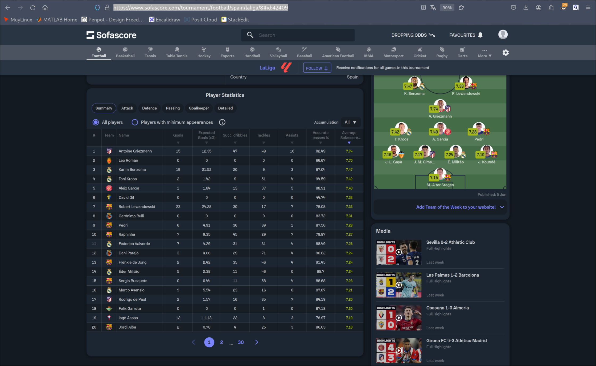
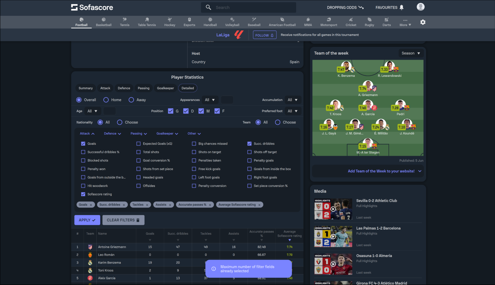
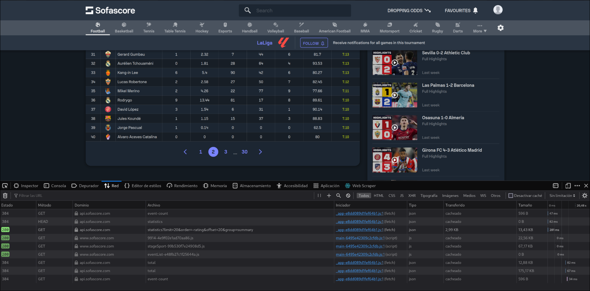
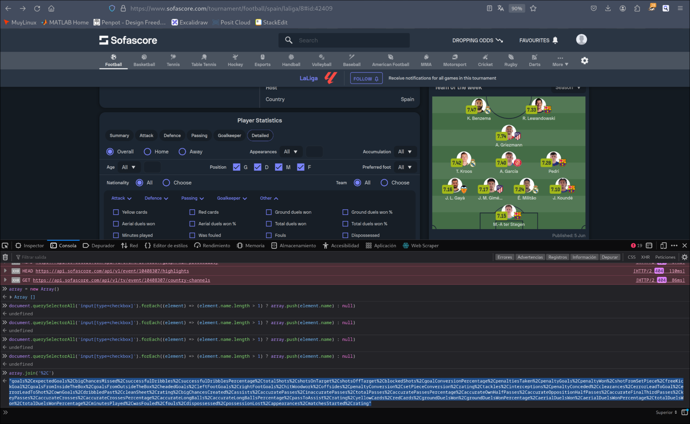
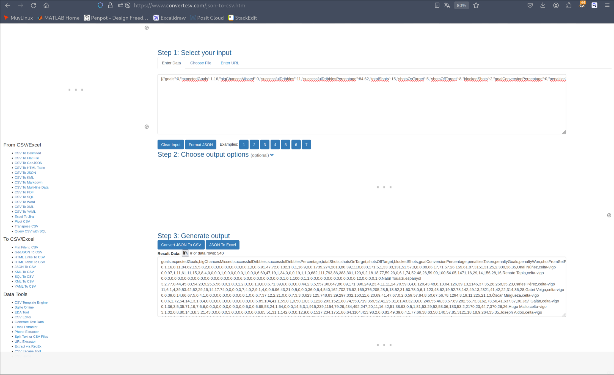
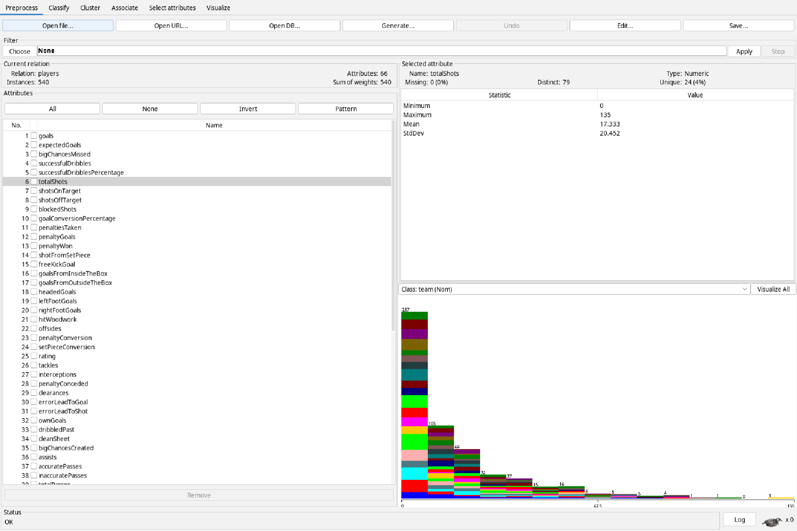

# Trabajo optativo de web scrapping / API. Yeray Li Loaiza

En este informe vamos a explicar como hemos recopilado el dataset `liga2022-2023.arff` que recopila diferentes estadísticas, de todos los jugadores profesionales de la Liga, como goles, faltas, tiros a puerta, pases clave etc. Todos estos datos los hemos extraido de la web [Sofascore](www.sofascore.com) que es famosa por recopilar este tipo de información. Nuestro dataset tiene en total 541 línea y se podría extrapolar a cualquier liga o competición que recopile Sofascore.

Para obtener estos datos hemos usado JavaScript vanilla y también hemos usado la api de Sofascore ya que nos permitia fetchear todos los datos que queriamos de una manera más rápida. Lo explicaremos a medida que mostremos el procedimiento.

Lo primero fue entrar a la web de [Sofascore](www.sofascore.com) y buscar la liga que queremos scrapear. En este caso [la liga española, temporarada 2022-2023](https://www.sofascore.com/tournament/football/spain/laliga/8#id:42409). Vamos a estudiar un poco la web y con el primer vistazo vemos que tenemos miles de datos de donde podemos aplicar nuestras técnicas de scrapeo. Si nos deslizamos al final de la web podemos ver una tabla llamada *player stadistics*, que a modo de resumen, muestra distintos estadísticos de los jugadores. De aquí es donde vamos a obtener nuestra *data*.

 

Si pulsamos en *Detailed* vemos que tenemos decenas de estadísticos que scrapear, pero aquí también llegamos al primer problema. Solo nos deja seleccionar como máximo 6 estadísticos, además en cada *page* de la tabla solo nos deja ver a 20 jugadores de los 541 que hay en total.

 

### Guía paso a paso

Si analizamos el uso de la red cuando cambiamos a la segunda página de la tabla vemos que la web lo que está haciendo en realidad es hacer peticiones `GET` a la api de Sofascore `https://api.sofascore.com/api/v1/unique-tournament/8/season/42409/statistics?limit=100&offset=500&order=-id&accumulation=total`. Si modificamos un poco estos parámetros podemos hacer peticiones de hasta 100 jugadores y podemos extraer todos los *fields* de golpe. Pero para ello necesitaremos el nombre de las cabeceras para poder hacer la petición.

 

En JavaScript con la consola del navegador creamos un array.

```
myArray = new Array();
```

Para llenar este array con el nombre de las cabeceras vamos a seleccionar el nombre de las etiquetas de tipo `<input type=checkbox>` y las vamos *pusheando* en nuestro array creado. Usaremos el siguiente comando:

```
document.querySelectorAll('input[type=checkbox]').forEach((element) => (element.name.length > 1) ? myArray.push(element.name) : null)
```

Una vez hemos llenado nuestro array vamos imprimirlo en una línea pero con los caracteres `%2C` que serán los separadores a la hora de hacer la petición.

```
myArray.join('%2C')
```

 

Obtenemos el siguiente resultado:

```
"goals%2CexpectedGoals%2CbigChancesMissed%2CsuccessfulDribbles%2CsuccessfulDribblesPercentage%2CtotalShots%2CshotsOnTarget%2CshotsOffTarget%2CblockedShots%2CgoalConversionPercentage%2CpenaltiesTaken%2CpenaltyGoals%2CpenaltyWon%2CshotFromSetPiece%2CfreeKickGoal%2CgoalsFromInsideTheBox%2CgoalsFromOutsideTheBox%2CheadedGoals%2CleftFootGoals%2CrightFootGoals%2ChitWoodwork%2Coffsides%2CpenaltyConversion%2CsetPieceConversion%2Crating%2Ctackles%2Cinterceptions%2CpenaltyConceded%2Cclearances%2CerrorLeadToGoal%2CerrorLeadToShot%2CownGoals%2CdribbledPast%2CcleanSheet%2Crating%2CbigChancesCreated%2Cassists%2CaccuratePasses%2CinaccuratePasses%2CtotalPasses%2CaccuratePassesPercentage%2CaccurateOwnHalfPasses%2CaccurateOppositionHalfPasses%2CaccurateFinalThirdPasses%2CkeyPasses%2CaccurateCrosses%2CaccurateCrossesPercentage%2CaccurateLongBalls%2CaccurateLongBallsPercentage%2CpassToAssist%2Crating%2CyellowCards%2CredCards%2CgroundDuelsWon%2CgroundDuelsWonPercentage%2CaerialDuelsWon%2CaerialDuelsWonPercentage%2CtotalDuelsWon%2CtotalDuelsWonPercentage%2CminutesPlayed%2CwasFouled%2Cfouls%2Cdispossessed%2CpossessionLost%2Cappearances%2CmatchesStarted%2Crating"
```

Con esto ya podemos escribir nuestro pequeño script que nos servirá para obtener los datos.

```{javascript}
const fs = require('fs')

const fields = "fields=goals%2CexpectedGoals%2CbigChancesMissed%2CsuccessfulDribbles%2CsuccessfulDribblesPercentage%2CtotalShots%2CshotsOnTarget%2CshotsOffTarget%2CblockedShots%2CgoalConversionPercentage%2CpenaltiesTaken%2CpenaltyGoals%2CpenaltyWon%2CshotFromSetPiece%2CfreeKickGoal%2CgoalsFromInsideTheBox%2CgoalsFromOutsideTheBox%2CheadedGoals%2CleftFootGoals%2CrightFootGoals%2ChitWoodwork%2Coffsides%2CpenaltyConversion%2CsetPieceConversion%2Crating%2Ctackles%2Cinterceptions%2CpenaltyConceded%2Cclearances%2CerrorLeadToGoal%2CerrorLeadToShot%2CownGoals%2CdribbledPast%2CcleanSheet%2Crating%2CbigChancesCreated%2Cassists%2CaccuratePasses%2CinaccuratePasses%2CtotalPasses%2CaccuratePassesPercentage%2CaccurateOwnHalfPasses%2CaccurateOppositionHalfPasses%2CaccurateFinalThirdPasses%2CkeyPasses%2CaccurateCrosses%2CaccurateCrossesPercentage%2CaccurateLongBalls%2CaccurateLongBallsPercentage%2CpassToAssist%2Crating%2CyellowCards%2CredCards%2CgroundDuelsWon%2CgroundDuelsWonPercentage%2CaerialDuelsWon%2CaerialDuelsWonPercentage%2CtotalDuelsWon%2CtotalDuelsWonPercentage%2CminutesPlayed%2CwasFouled%2Cfouls%2Cdispossessed%2CpossessionLost%2Cappearances%2CmatchesStarted%2Crating"

const filters = "filters=position.in.D~M~F"
var limit = 100
var offset = 0

var apiURL = `https://api.sofascore.com/api/v1/unique-tournament/8/season/42409/statistics?limit=${limit}&offset=${offset}&order=-id&accumulation=total&${fields}&${filters}`

var players = new Array()

for( offset = 0 ; offset <= 500 ; offset += limit ) {

  let apiURL = `https://api.sofascore.com/api/v1/unique-tournament/8/season/42409/statistics?limit=${limit}&offset=${offset}&order=-id&accumulation=total&${fields}&${filters}`

  fetch(apiURL)
    .then(response => {
      if (!response.ok) {
      throw new Error('Network response was not ok');
      }
      return response.json();
    })
    .then(data => {
      var resultado = data.results
      resultado.forEach( (element) => {
        element.player = element.player.name
        element.team = element.team.slug
        players.push(element)
      })
    }).then( data => {
      fs.writeFileSync("players.json",JSON.stringify(players),"utf-8");
    })
    .catch(error => {
      console.error('Error:', error);
   });
}
```

Lo que hacemos en el bucle `for` es en cada iteración obtenemos 100 jugadores. Luego arreglamos su nombre y su equipo para que todos los datos de cada objeto sean de tipo `string` y después los agregamos al vector `players`. Hacemos esto 5 veces. Una vez tenemos el vector jugadores completo, lo escribimos en el archivo `players.json`.

Ejecutando esto obtendremos un archivo de tipo `.json` con todos los jugadores y los 67 estadísticos. Para obtener el archivo `.csv` que necesitamos hemos usado una simple aplicación online que nos ha hecho el trabajo sucio.

 

Y con este archivo ya lo podríamos cargar en *Weka* y visualizar sus datos.



De esta manera habremos terminado el scrapeo. Con sencilla modificaciones sería posible crear un *dataset* de estos estadísticos pero con todos los jugadores de las 5 principales ligas de Europa, aunque esto lo realizaré si me veo bien de tiempo :)
